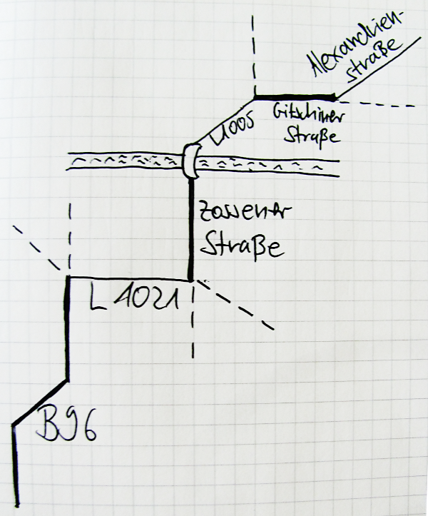
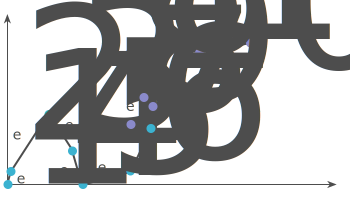
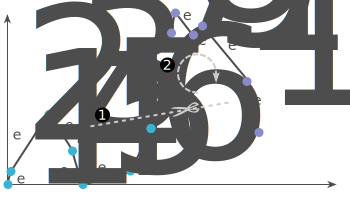
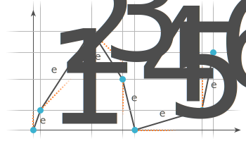
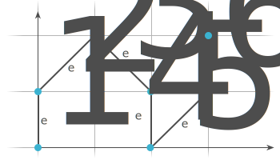
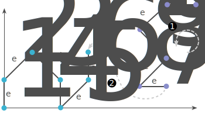

% Routing Sketches
% Patrick Niklaus
% 13. November 2014

# Who am I

## Patrick

* Work for Mapbox, part of the Mapbox Directions team
* Computer Science Student: Karlsruhe Institute of Technology

# Mapbox {data-background='rgb(59, 178, 208)'}

## Mapbox &#x2665; OSRM {data-background='images/osrm_background.png'}

* Most people already know us for our beautiful mobile friendly maps

* Mapbox Directions: Expanding into routing

* Powered by the brilliant Open Source Routing Machine

# So, what was this talk about again?

## In The Olden Days

How did you plan a route from **A** to **B**?

&#8627; Look it up on a map* &#8596; Ask someone

<small>(\*) possibly made from dead trees.</small>

## Your memory sucks

**Solutions:**

1. Write down a list of routing instructions

2. Just draw a quick sketch.

## What do we get today? {data-background='images/apple_maps_background.png'}

Take out Smartphone, *\*swipe\**, *\*type\** &#8594; Done.

## Perfect, right?

For interactive routing? Sure.
But does the route preview really show you **relevant** information?

<iframe src="http://project-osrm.org/osrm-frontend-v2/?hl=en&loc=52.463146,13.343553&loc=52.502325,13.403149&z=13&center=52.490568,13.378601&alt=0&df=0&re=0&ly=763558683" width="800px" height="500px">
</iframe>

## Let's have a look at the old sketch again
<!--

* The route was abstracted: not the real geometry

* Much more relevant information:
  1. Turns are clearly visible
  2. Road segments identifiable easily
  3. Additional landmarks included
  4. Shape of intersection

-->

<svg style="position: absolute; left: 0; top: 0; z-index: 2; width: 100%; height: 100%;">
  <defs>
    <marker id="markerArrowBlue" markerWidth="7" markerHeight="7" refx="1" refy="3.5" orient="auto" class="clr-blue">
      <path d="M1,1 L1,6 L6,3.5 L1,1"/>
    </marker>
    <marker id="markerCircleBlue" markerWidth="14" markerHeight="14" refx="1px" refy="7px" orient="auto" class="clr-blue">
      <circle cx="7" cy="7" r="6" style="stroke-width: 1px;"/>
    </marker>
    <marker id="markerArrowPurple" markerWidth="7" markerHeight="7" refx="1" refy="3.5" orient="auto" class="clr-purple">
      <path d="M1,1 L1,6 L6,3.5 L1,1"/>
    </marker>
    <marker id="markerCirclePurple" markerWidth="14" markerHeight="14" refx="1px" refy="7px" orient="auto" class="clr-purple">
      <circle cx="7" cy="7" r="6" style="stroke-width: 1px;"/>
    </marker>
  </defs>
  <g class="fragment diagram-arrow">
    <line x1="370px" x2="275px" y1="430px" y2="380px" style="marker-end: url(#markerCircleBlue);" class="clr-blue"/>
    <text x="410px" y="470px" class="clr-blue">Turns clearly visible</text>
  </g>
  <g class="fragment diagram-arrow">
    <line x1="370px" x2="94px" y1="600px" y2="535px" style="marker-end: url(#markerArrowBlue);" class="clr-blue"/>
    <text x="370px" y="640px" class="clr-blue">Road segments identifiable</text>
  </g>
  <g class="fragment diagram-arrow">
    <line x1="160px" x2="240px" y1="100px" y2="195px" style="marker-end: url(#markerCirclePurple);" class="clr-purple"/>
    <text x="160px" y="80px" class="clr-purple">Landmarks</text>
  </g>
  <g class="fragment diagram-arrow">
    <line x1="80px" x2="85px" y1="300px" y2="350px" class="clr-purple" style="marker-end: url(#markerCirclePurple);"/>
    <text x="120px" y="280px" class="clr-purple">Intersections</text>
  </g>
</svg>

<ul class="fragment box-diagram" style="margin-top: -20px;">
<li>

Geometric Schematization

</li>
<li>

Context Information

</li>
</ul>

# Geometry Schematization

## Previous Work

* In *Algorithmic Geometry* this building block is called *Path Schematization*:
	1. Limit angles of edge orientation to a fixed set
	2. Enforce minimum edge length
	3. Minimize overall path length
* Delling et al. formalized a complete theoretical framework and algorithms
to do this.
* But the algorithms were too slow for our application, so we derived a fast approximation

## Gory Algorithmic Details

<!---
1. This problem is hard. Let's solve a simple problem: 
     &#8627; Only schematize *x-monotone increasing* sub-paths.

2. Input path is probably not *x-monotone increasing*. 
     &#8627; Split in monotone sub-path and mirror + rotate them to be x-monotone increasing

3. Stitch them back together
-->

Input path:

## Simplify the problem

Split the input path into monotone sub-paths and make them *x-monotone increasing*.

## Schematize sub-path

* Only certain angles are allowed for edges in a schematization.  
&#8594; Use the one that is closed.

* Restriction: only change the spacing of the columns and rows of the grid.  
 (not always possible &#8594; find the best schematization)

## Stitching all back together

Connect the schematized sub-paths to build the complete path.

# Demo

## Original vs. Sketch

<iframe src="http://54.69.126.202/frontend/main.html?hl=en&loc=52.463146,13.343553&loc=52.502325,13.403149&z=12&center=52.490568,13.378601&alt=0&df=0&re=0&ly=763558683" width="800px" height="500px">
</iframe>

## Thanks! {data-background='#8A8ACB'}

C++ software developer? We are hiring!  
**mapbox.com/jobs**

