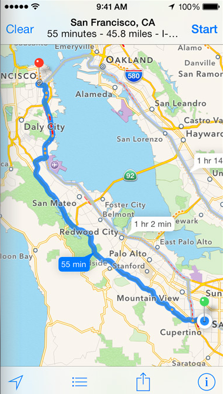

% Learning from the Pre-Smartphone World
% Patrick Niklaus
% 13. November 2014

# Who am I

## Patrick

* Computer Science Student
* Karlsruhe Institute of Technology
* Work for Mapbox, part of the Mapbox Directions team

# Mapbox {data-background='rgb(59, 178, 208)'}

## Mapbox <3 OSRM {data-background='images/osrm_background.png'}

* Most people already know us for our beautiful mobile friendly maps

* Expanding into routing: Mapbox Directions

* Powered by the awesome Open Source Routing Machine

<!-- Picture of website -->

# So, what was this talk about again?

## In The Olden Days

How did you plan a route from **A** to **B**?

&#8627; Look it up on a map* &#8596; Ask someone

<small>(\*) possibly made from dead trees.</small>

## Your memory sucks

**Problem:**

Your memory tends to be a lossy form of information storage.

**Solutions:**

1. Write down a list of routing instructions

2. Just draw a quick sketch.

<!-- insert image here -->

## What do we get today? {data-background='images/apple_maps_background.png'}

Take out Smartphone, *\*swipe\**, *\*type\** &#8594; Done.

<!-- img src="images/apple_maps.png" id="apple-maps" height="20%" -->

## Perfect, right?

* For interactive routing? Sure.

* But does the route preview really show you **relavant** information?

## Let's have a look at the old sketch again

* Much more relevant information

* We abstracted the route automatically and made the information more dense

